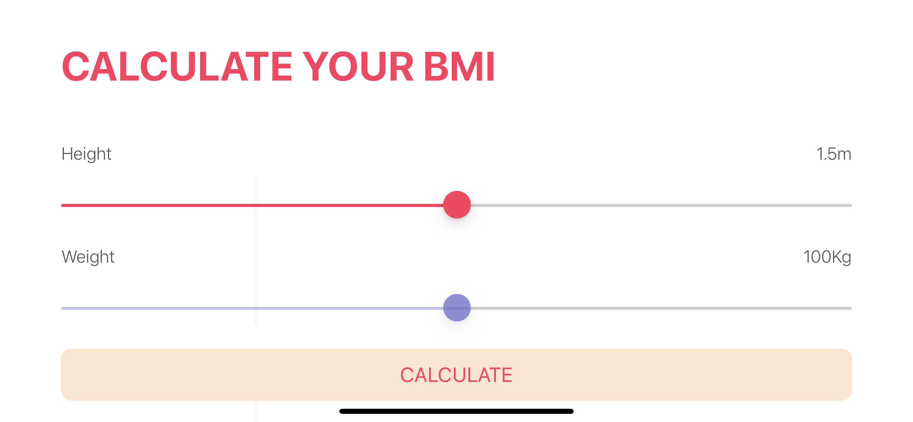

# BMI
A Body Mass Index -BMI calculator. Based on the user’s mass and height it will calculate their body mass index and give a piece of health advice depending on whether if they are healthy, need more food or less. This app was created following Angela Yu's Course on Udemy with some amendements.

<table>
 <tr>
    <td> • GIF </td>
    <td> • Landscape Shot 1</td>
    <td> • Landscape Shot 2</td>
  </tr> 
  <tr>
    <td> </td>
    <td></td>
      <td></td>
  </td>
  </tr>
